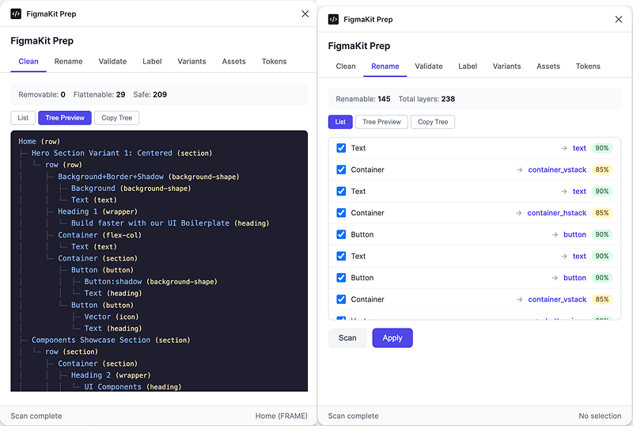
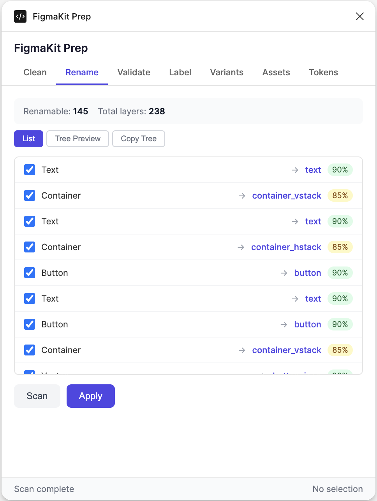
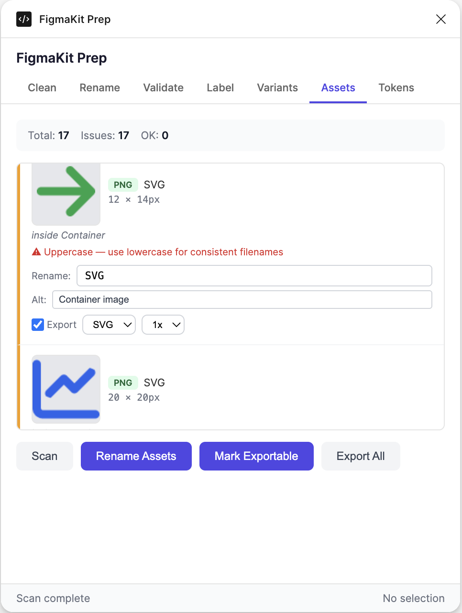
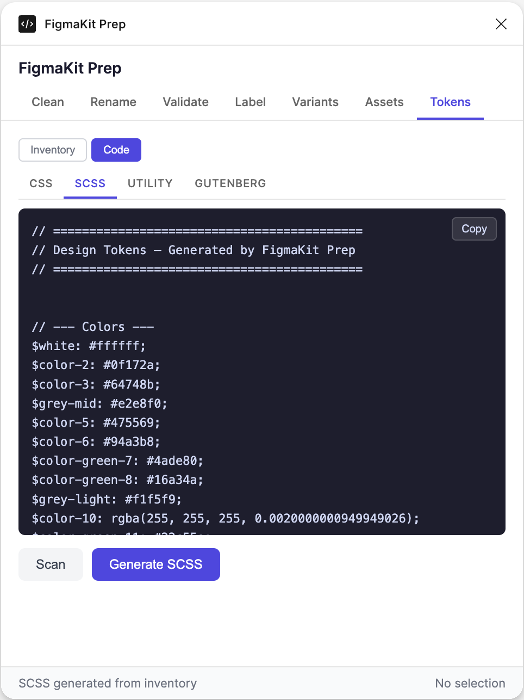

# FigmaKit Prep

Prepare your Figma files for accurate WordPress import. Clean layers, rename nodes semantically, validate structure, preview design tokens, manage exportable assets, and map component variants — all before syncing to WordPress with FigmaKit.

<p align="center">
  
</p>

## Features

### Clean
Remove invisible, empty, and decorative layers. Flatten redundant single-child wrappers. Preview the cleaned tree structure before applying changes. Safe operation — never removes nodes with fills, strokes, effects, corner radius, padding, or gap.

- Remove hidden layers (visible: false)
- Remove zero-opacity layers
- Remove empty containers with no visual contribution
- Flatten passthrough wrappers (single child, no visual properties)
- Detect redundant nesting (Container > Container chains)
- Skip decorative layers (:shadow, +border, overlay, mask, gradient, noise)
- Tree Preview showing the final cleaned hierarchy
- Copy Tree as plain text to clipboard

### Rename
Auto-assign semantic names that match FigmaKit's WordPress resolver patterns. Parent-context-aware — children of composite components get prefixed names (card-header, card-body, hero-title, button_label).

- Detect 30+ node roles: section, row, column, group, card, hero, feature, cta, testimonial, accordion, tabs, modal, gallery, list, button, text, heading, image, icon, divider, spacer
- Parent-prefixed child naming: card-header, card-body, card-cta, hero-title, hero-description, button_label, button_icon
- Heading level detection by font size: h1 (48px+), h2 (36px+), h3 (28px+), h4 (22px+), h5 (18px+)
- Layout suffix convention: container_vstack, container_hstack, group_vstack
- Structural lowercase: Section → section, Card → card, Button → button
- Nested section prevention: only root gets "section", children become "group"
- Strip Figma variant suffixes: "card/Default" → "card"
- Detect decorative patterns: Background+Border+Shadow, Button:shadow, HorizontalBorder
- Detect scientific diagrams and complex graphics for auto-skip
- Recognize navigation patterns: nav, navlink, menu → list/list-item
- Recognize forms, modules, logos, FPO placeholders
- Tree Preview showing the full renamed hierarchy
- Copy Tree as plain text

<p align="center">
  
</p>

### Validate
Confidence report showing how well FigmaKit will map each layer. Categorizes nodes into high (90%+), needs review (50-89%), low (<50%), and skipped tiers.

- Confidence scoring based on detection method (type: 90, role: 85, structure: 80, name: 60, default: 30)
- Suggested actions for low-confidence layers (rename, clean, or add mapping)
- Page Structure Summary: section count, component count, text nodes, images, max depth, layer count
- Text Content Preview: shows extracted text per block — headings with level, button labels, body copy

### Label
Add explicit `[fk:type]` prefixes or plugin data for 100% confidence detection override.

- Prefix mode: `[fk:card] Product Card`
- Plugin data mode: stores type in Figma plugin data
- Both mode: prefix + plugin data
- Remove labels
- Batch labeling: label all children based on detected roles
- BEM Formatter: auto-name children of composite components (card__image, card__title, hero__cta)

### Variants
Detect Figma component variants and preview the CSS modifier classes that FigmaKit will generate.

- Scan INSTANCE nodes for variant properties (Type, Size, Style, State)
- Generate BEM modifier classes: fk-button--primary, fk-card--large
- Preview the exact CSS classes the WordPress plugin will produce
- Matches FigmaKit's `add_variant_classes()` logic

### Assets
Analyze and manage exportable assets (images, icons, SVGs). Preview thumbnails, check naming conventions, set export settings, and batch export.

- Detect exportable nodes: images with fills, SVG containers, vector icons, logos
- Smart parent detection: "logo" with vector children = one asset, not individual vectors
- Thumbnail previews (72px) with dark background for white assets
- Naming validation: flag generic names, uppercase, spaces, special characters
- Inline rename with suggested names based on parent context
- Alt text suggestions from sibling text, parent context, or layer name
- Set export format per asset: PNG, SVG, JPG, PDF
- Set export scale: 1x, 2x, 3x
- Mark Exportable: sets Figma export settings on nodes (adds to right panel > Export)
- Batch Export All: downloads all checked assets as individual files with progress bar
- Live format badge update when changing export format

<p align="center">
  
</p>

### Tokens
Aggregate design tokens from all nodes in the selection. Inventory view with editable names, plus code generation.

- **Colors**: unique colors with swatches, hex/rgba values, usage count, suggested names
- **Fonts**: unique font families with count
- **Text Styles**: unique fontSize/weight/family combos mapped to FigmaKit utility classes (fk-text-title, fk-text-body-md, fk-text-eyebrow, etc.)
- **Spacing**: unique spacing values snapped to the spacing scale (4xs through 3xl)
- **Spacing Consistency Checker**: flags near-miss values (23px → suggest 24px/md)
- **Color Near-Duplicate Detection**: groups similar colors (RGB distance < 15) with consolidation suggestions
- **Generate SCSS**: creates SCSS variables from the inventory with editable token names
- **Code Preview**: formatted output in CSS variables, SCSS, utility classes, or Gutenberg block attributes

<p align="center">
  
</p>

## Detection Rules

### Auto-detected layer names (no rename needed)
```
section, row, column, col, vstack, hstack, group, container
hero, card, feature, cta, testimonial, accordion, tabs, modal, isi
button, btn, text, heading, h1-h6, image, img, icon, logo
list, menu, nav-list, item, divider, separator, footer, header
```

### Auto-skipped layer names
```
background, bg, shadow, overlay, blur, border, stroke, mask
gradient, effect, glow, noise, texture, decoration, ornament
Any name with (skip) or (ignore)
Any name with :shadow, :blur, :overlay, :margin suffix
Background+Border+Shadow, HorizontalBorder, Mask group
```

### Layer naming for WordPress mapping

| Figma Layer | Divi 4 | Divi 5 | Gutenberg |
|---|---|---|---|
| section | et_pb_section | divi/section | core/group |
| row | et_pb_row | divi/row | core/columns |
| column | et_pb_column | divi/column | core/column |
| card | et_pb_row | divi/row | wp-figmakit/fk-card |
| card-header | et_pb_image | divi/image | core/image |
| card-body | et_pb_text | divi/text | core/paragraph |
| card-cta | et_pb_button | divi/button | core/button |
| hero | et_pb_fullwidth_header | divi/fullwidth-header | wp-figmakit/fk-hero |
| button | et_pb_button | divi/button | core/button |
| h1-h6 | et_pb_text | divi/text | core/heading |
| image | et_pb_image | divi/image | core/image |
| divider | et_pb_divider | divi/divider | core/separator |
| accordion | et_pb_accordion | divi/accordion | wp-figmakit/fk-accordion |
| tabs | et_pb_tabs | divi/tabs | wp-figmakit/fk-tabs |

## Install

### Development (Figma Desktop)

```bash
git clone https://github.com/your-org/figmakit-prep.git
cd figmakit-prep
npm install
npm run build
```

In Figma Desktop: **Plugins > Development > Import plugin from manifest** and select the `manifest.json` file.

### Usage

1. Open a Figma file
2. Run FigmaKit Prep from the plugins menu (Plugins > Development > FigmaKit Prep)
3. Select frames in the layers panel (or leave empty to scan entire page)
4. Use the tabs: Clean, Rename, Validate, Label, Variants, Assets, Tokens

## Development

```bash
npm run dev        # Watch mode (rebuild on change)
npm run build      # Production build
npm test           # Run tests
npm run typecheck  # TypeScript type checking
```

### Project Structure

```
src/
├── main.ts                  # Plugin entry (Figma sandbox)
├── ui.html                  # Plugin UI (tabbed interface)
├── ui.ts                    # UI logic & rendering
├── core/
│   ├── analyzer.ts          # Shared analysis engine
│   ├── classifier.ts        # Node role classification
│   ├── fingerprinter.ts     # Structural fingerprinting
│   └── safety-check.ts      # Safe removal/flattening logic
├── features/
│   ├── cleaner.ts           # Layer Cleaner
│   ├── renamer.ts           # Smart Layer Renamer
│   ├── validator.ts         # Pre-flight Validator
│   ├── labeler.ts           # Component Property Labeler
│   ├── bem-formatter.ts     # BEM Name Formatter
│   ├── token-preview.ts     # Design Token Preview
│   ├── token-aggregator.ts  # Token Aggregation & Inventory
│   ├── asset-analyzer.ts    # Exportable Asset Detection
│   ├── variant-mapper.ts    # Component Variant → CSS Mapping
│   ├── text-content.ts      # Text Content Extraction
│   ├── structure-summary.ts # Page Structure Summary
│   ├── spacing-checker.ts   # Spacing Consistency Checker
│   ├── color-checker.ts     # Color Near-Duplicate Detection
│   └── alt-text.ts          # Alt Text Suggestions
└── shared/
    ├── types.ts             # TypeScript interfaces
    ├── constants.ts         # Thresholds, scales, limits
    ├── patterns.ts          # Name pattern matching
    └── figma-helpers.ts     # Safe Figma API access wrappers
```

### Testing

Tests use [vitest](https://vitest.dev/) with mock Figma API factories in `tests/helpers/figma-mock.ts`.

```bash
npm test              # Run all tests
npm run test:watch    # Watch mode
```

### Technical Notes

- **Figma API**: All node property access uses safe wrappers (`safeGetString`, `safeGetNumber`, `safeGetArray`) to handle `figma.mixed` Symbol values
- **Build**: esbuild with es2015 target for Figma sandbox compatibility. UI is not minified to prevent variable name collisions
- **Async**: Uses `figma.getNodeByIdAsync()` for dynamic-page document access
- **No external dependencies**: Figma plugin sandbox doesn't allow npm imports at runtime